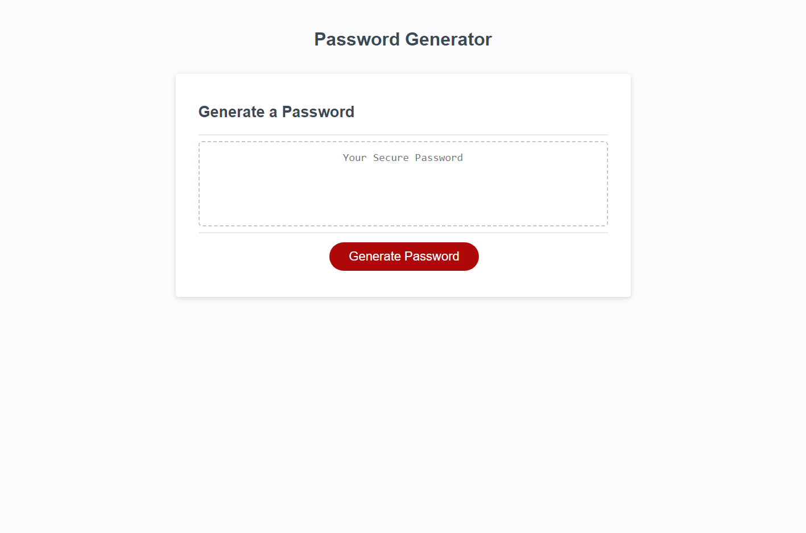

# Random_Password_Generator

## Description

The purpose of this software is to allow the user to make a completely random password at the click of a button. It will also give the user options as to how detailed the generated password will be. I learned how to properly use for loops and I have a much better understanding of functions.

## Installation

None necessary

## Usage

```md

```

## License

MIT License